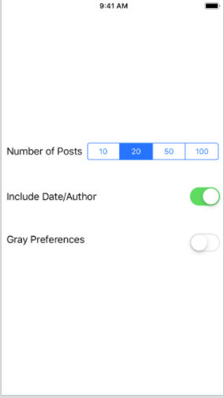

# Module Challenge: Auto Layout II - Adaptive Auto Layout

This challenge allows you to push forward on the concepts and techniques learned in today's guided lesson and apply them in a concrete project. Your lesson explored Auto Layout. You demonstrate continued proficiency by creating an application that showcases the same features you learned in class.

## Instructions

**Read these instructions carefully. Understand exactly what is expected _before_ starting this Challenge.**

This is an individual assessment but you are permitted to consult with and support other members of your cohort. You are encouraged to follow the twenty-minute rule and seek support from your PM and Instructor in your cohort help channel on Slack. 

## Commits

Commit your code regularly and meaningfully. This helps both you (in case you ever need to return to old code for any number of reasons) and your project manager.

## Description

In this challenge, you build a series of interfaces using view (xib) files to lay out your content.

## Questions

Demonstrate your understanding of today's concepts by answering the following free-form questions. Submit them as a text file along with your project.

* What is auto layout and why do iOS developers use it?
        Auto layout is a technology that allows developers to create dynamically adaptive layouts for many screens, devices, orientations and devices. 
* When do you use compression resistance? When do you use content hugging?
        Compression resistance lets us state that a certain view or visual element should resist being compressed. Content hugging lets us get rid of padding around an element. 
* When do you adjust priorities and why? 
        Interface builder needs to understand the hierarchy of priorities so it should be adjusted anytime multiple priorities and similar or when the behavior of your layout needs adjusting. 
* When should you nest stack views? What challenges are involved in nesting stack views? 
        You should almost always use stack views and nesting them should be used then you want to vertically or horizontally align items in your views. Spacing, alignment and orientation can all be challenges but are also solveable. 
* How does text autoshrink work and what are its advantages and disadvantages?
        It allows us to set a minimum size text so text can be shrunken before it is truncated using an ellipsis. It can have unexpected results as it tries to balance shrinking or not shrinking the text and surrounding visual elements. 
        
## Project Note

Today you are not building a full project. You will create several view files (xib files) and then build the contents according to the following challenges.

To set up, drag the image sets into your primary asset catalog.

## Challenge 1

Duplicate this layout. There are 2 brown views, two orange views, and the image view, which uses the image provided from "photo.imageset". The brown views take up 1/4 each of the safe space. There are 40 pixels between the brown views and the orange views and between the orange views and the image. 

The orange and brown views are flush to the sides.

You may not manually resize the image frame. Work with whatever frame you dragged out from the image library.

# Challenge 2

This table view cell is 120 pixels high. On the left are two labels with 8 points between them and 8 points to the leading edge. One has three lines of large text. One has one line of small text. The image view on the right is 100x100 and is 20 points away from the two labels and 8 points from its trailing edge.

# Challenge 3 

Create this settings screen. It consists of three options with labels on the left and controls on the right (a segmented control and two switches). Leave 50 points between each line. Controls are right aligned. The labels are left aligned. The set of settings is centered vertically. There are at least 8 points between each label and control. There are at least 8 points of spacing between the view edges and any content.

# Challenge 4

Create this layout. It has a large title, followed by a normal body-sized description, followed by a small info line. There is next an image view, whose height is fixed to 128 points. It uses aspect fill. The layout finishes with a text view that always occupies 1/3 of the available height.

The layout is padded to each size by 20 points of spacing.

## Minimum Viable Product

Your finished project must include all of the following requirements:

* Your layouts work properly in both portrait and landscape orientations.
* Your layouts work properly on several different target screens, including a wide variety of geometries.
 
## Stretch Problems

After finishing your required elements, push your work further. These goals may or may not be things you learned in this module but they build on the material you just studied. Time allowing, stretch your limits and see if you can deliver on the following optional goals:

* Update Challenge 4 to provide separate layouts for vertical and horizontal presentation.
* Add a "like" button to the cell of Challenge 2, placing it on the left side of your layout.
